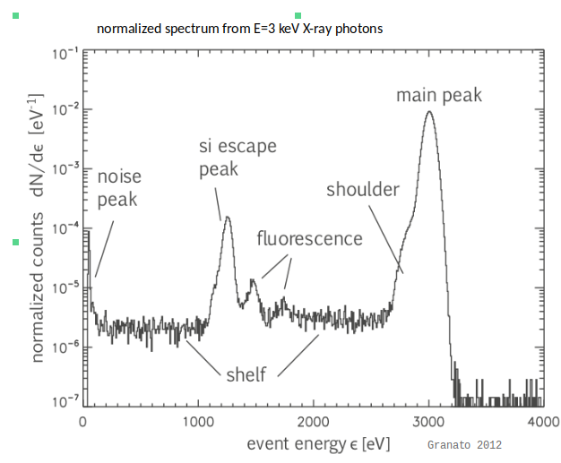
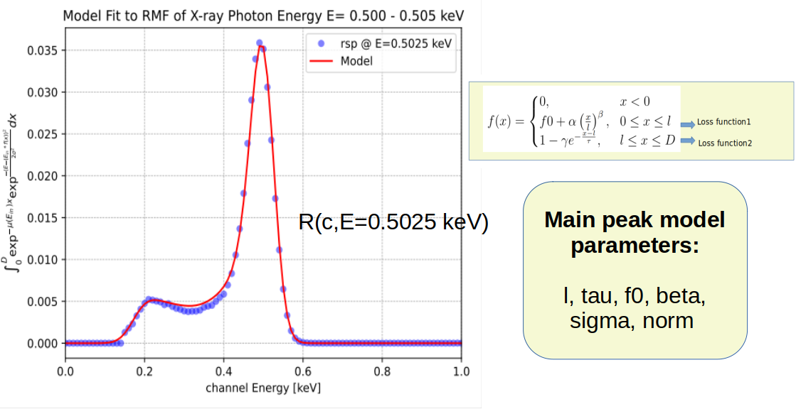

# CCD Calibration of SXT – AstroSat  
## Response Modeling and RMF Parameterization

## Overview

This project was designed and executed to build **robust data extraction, transformation, and cleaning pipelines** that convert raw, domain-specific AstroSat–SXT files into **structured, analysis-ready datasets**.

Detector response models were **validated and calibrated** using a combination of **Bayesian inference (PyMultiNest)** and **least-squares optimization**, with calibration data serving as constraints. The workflow leverages **parallel computing** to ensure computational efficiency, reproducibility, and scalability.

The repository includes **plots and visual diagnostics** demonstrating model fits, posterior distributions, convergence behavior, and calibration performance, enabling transparent validation of results.

---

## Methodology

### Data Preparation

Raw AstroSat–SXT domain-specific files are ingested and transformed into structured datasets suitable for statistical modeling. This includes:

- Data extraction and cleaning  
- Energy binning and normalization  
- Consistency and integrity checks prior to calibration  

### Response Modeling

The SXT detector response is modeled analytically by parameterizing the **Redistribution Matrix Function (RMF)**. For an incident X-ray photon of energy \(E_{in}\), the spectral redistribution can be expressed as an integral over the CCD depth:

\[
N(E) \propto \int_{0}^{D} e^{-\mu(E_{in})x}
\exp\left[-\frac{(E - E_{in} f(x))^2}{2\sigma^2}\right] dx
\]

Following *Godet et al. (2008)*, the depth-dependent **charge loss function** \(f(x)\) is used for modeling the RMF distribution.

---

## Parameterization of the RMF

The charge loss function is defined piecewise to capture multiple charge collection regimes within the CCD depletion depth:

- **Region 1:** No charge collection (x < 0)  
- **Region 2:** Power-law charge loss (0 ≤ x ≤ l)  
- **Region 3:** Exponential loss tail (l ≤ x ≤ D)  

This parameterization enables flexible modeling of the **low-energy redistribution tail**, shoulder structure, and main peak shape in the RMF.

**Main peak model parameters:**

- `l` : Transition depth  
- `tau` : Exponential loss scale  
- `f0`, `alpha`, `beta` : Charge loss parameters  
- `sigma` : Energy resolution  
- `norm` : Overall normalization  

*Figure: Analytical parameterization of the SXT RMF using a depth-dependent charge loss model.*

---

## Spectral Redistribution Features Modeled

The spectral redistribution of incident X-ray photons in the SXT CCD exhibits multiple characteristic features, all of which are explicitly considered in the response modeling.

The modeled features include:

- **Main Peak**: The primary response peak corresponding to full charge collection, modeled as a Gaussian core convolved with charge loss effects.
- **Low-Energy Shoulder**: Caused by partial charge loss near the entrance window.
- **Fluorescence Peaks**: Secondary peaks produced when high-energy photons excite detector material (e.g., silicon).
- **Escape Peak**: Events with detected energy reduced by the fluorescence photon energy.
- **Noise Peak**: Contributions from readout and electronic noise exceeding the detection threshold.
- **Spectral Shelf**: A flat, low-level continuum from incomplete charge collection and background processes.

These physically motivated features guide the RMF parameterization and fitting strategy.

---

## Example: RMF Re-computation and Visualization

An example comparison between the **original SXT RMF** and the **recomputed analytical model** is shown for a representative photon energy (e.g., **0.5025 keV**).

The comparison demonstrates:

- Accurate reproduction of the main response peak  
- Realistic modeling of the low-energy redistribution tail and shoulder  
- Good agreement between calibration data and analytical fits  

These plots serve as direct validation of the response modeling approach.

---

## Constraining Model Parameters

Model parameters are constrained using a combination of:

- **Least-squares optimization** for rapid convergence  
- **Bayesian inference (PyMultiNest)** to estimate posterior distributions, uncertainties, and parameter correlations  

Parallel computing is used to improve efficiency and reproducibility.

*(An example posterior distribution or parameter constraint plot will be added here.)*

---

## Tools & Key Skills

- **Programming:** Python  
- **Libraries:** NumPy, SciPy, lmfit, matplotlib, multiprocessing, PyMultiNest  
- **Techniques:**  
  - Bayesian inference  
  - Parameter estimation  
  - Statistical optimization  
  - Analytical detector response modeling  
  - Parallel computing  
  - Reproducible research  

---
## References

- Godet et al. (2008), *Modeling the spectral response of CCD detectors*  
- AstroSat SXT Instrument Handbook  
- AstroSat Mission Documentation  

---

## Author

Saikruba Krishnan
